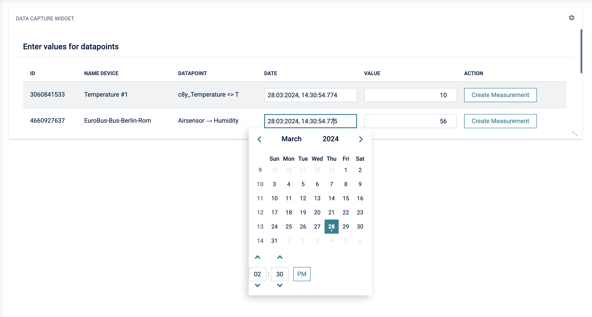

# Cumulocity data capture widget

This is a Cumulocity widget for data capturing. For a set of configured data points measurements can be manually created.
The configuration page allows to select the data points and if audit information about the user should be added to the audit log.

 

----------
These tools are provided as-is and without warranty or support. They do not constitute part of the Software AG product suite. Users are free to use, fork and modify them, subject to the license agreement. While Software AG welcomes contributions, we cannot guarantee to include every contribution in the master project.
